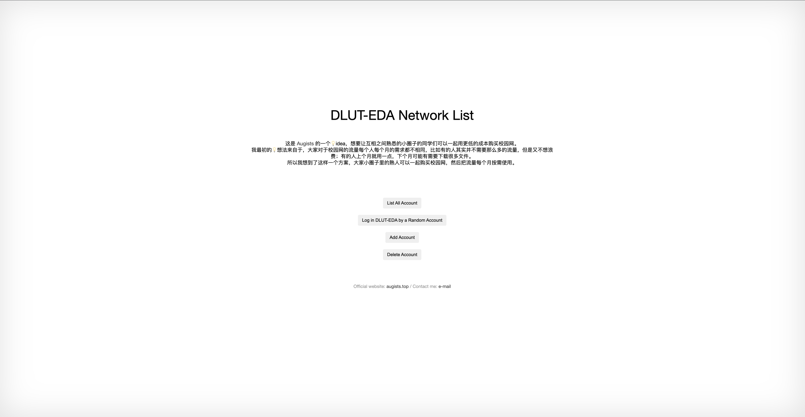

# DLUT-EDA Network List

我得承认这个项目是我的愿景，有些不够切合实际

我的想法💡是，大家都有自己的熟人小圈子：

* 每个人每个月对校园网的需求都是波动的
* 上个月用了 20 G，下个月我可能又会需要用 120 G
* 5 个人的小圈子，可能总共只会用 3 个人的量

所以我就想，通过这种方式，让大家均摊校园网的成本，同时也能让你在超量使用的情况下收到来自小圈子里别人的“援手”

它可能有点乌托邦了，但是我相信这能帮助一些人在一定程度上解决校园网的窘境

我把我的想法💡实在在这里，并使用 [Beego](https://github.com/beego/beego) 搭建了前后端将它实现得尽可能的简单易用，希望路过的你能受到启发

## 为什么仓库 archived 了

不绕圈子，我比较直

Archive 这个项目并不是因为我觉得它本身有什么问题，而是发生的事情让我一次又一次对这个学校失望透顶。我对这个学校的付出和不管是我看到的、接触的、收获的都不成正比，让我萌生了放弃为这个学校再做什么贡献的想法。当然，我已经接下的比如NAOSI、LUG我都会继续承担我的责任，所有该办的活动、例会、讲座我也都会继续把它办好。我没有将我今天的冲动和压抑的心态归咎于同学或是学校的学术，是剩下的那部分让我决定放弃对这个项目再有任何的想法，当然也包括其他很多我提出过idea并且与这个学校有关的项目

我热爱开源，因为我相信它能帮助到有需要的人，同时我也是从开源中学习的，收益于开源。但是这几年所发生的一切让我觉得它DUT不配让我把我热爱的东西和它沾上什么关系，所以才做出这样的决定

开源不死，江湖再见

## TODO

- [ ] 将 shell 脚本转化为 golang，不再依赖 [mega 的 DLUT-EDA-Login 项目](https://github.com/bboymega/dlut-eda-shell-login)
- [ ] 随机选择账户登陆失败后，继续随机下一个
- [ ] 打包为 Release 发布，多平台

## The MIT License

Copyright © 2022 <Augists>

Permission is hereby granted, free of charge, to any person obtaining a copy of this software and associated documentation files (the “Software”), to deal in the Software without restriction, including without limitation the rights to use, copy, modify, merge, publish, distribute, sublicense, and/or sell copies of the Software, and to permit persons to whom the Software is furnished to do so, subject to the following conditions:

The above copyright notice and this permission notice shall be included in all copies or substantial portions of the Software.

THE SOFTWARE IS PROVIDED “AS IS”, WITHOUT WARRANTY OF ANY KIND, EXPRESS OR IMPLIED, INCLUDING BUT NOT LIMITED TO THE WARRANTIES OF MERCHANTABILITY, FITNESS FOR A PARTICULAR PURPOSE AND NONINFRINGEMENT. IN NO EVENT SHALL THE AUTHORS OR COPYRIGHT HOLDERS BE LIABLE FOR ANY CLAIM, DAMAGES OR OTHER LIABILITY, WHETHER IN AN ACTION OF CONTRACT, TORT OR OTHERWISE, ARISING FROM, OUT OF OR IN CONNECTION WITH THE SOFTWARE OR THE USE OR OTHER DEALINGS IN THE SOFTWARE.
